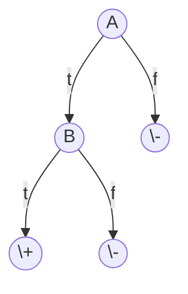
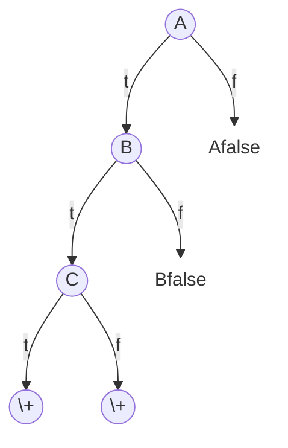
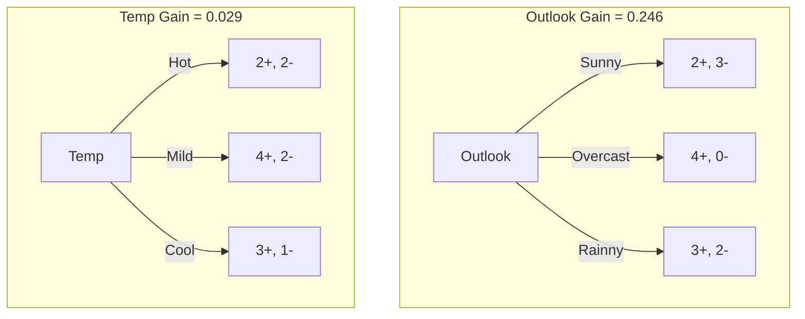

# Decision Tree

This session talks about:
- Decision tree representation
- ID3 learning algorithm
- Entropy, Information gain
- Overfitting

## Data

**Data name**: $PlayTennis$

**Features and possible value**:

| Feature | Number of possible values | Possible values | Note |
| :---: | :---: | :---: | :---: |
| $Outlook$ | 3 | $Sunny$, $Rain$, $Overcast$ |  |
| $Temperature$ | 3 | $Hot$, $Mild$, $Cool$ |  |
| $Humidity$ | 2 | $High$, $Normal$ |  |
| $Wind$ | 2 | $Strong$, $Weak$ |  |
| $PlayTennis$ | 2 | $Yes$: $+$, $No$: $-$ | Target Attribute<br>Binary Classification |

> Here we exclude: $Day$ as it is just an identifying attribute, a unique key to each datapoint.

All example possibility: 

$$ 3 \times 3 \times 2 \times 2 = 36\text{ possibilities} $$

**Examples**:

| $Day$ | $Outlook$ | $Temperature$ | $Humidity$ | $Wind$ | $PlayTennis$ |
| :---: | :---: | :---: | :---: | :---: | :---: |
| $D1$ | $Sunny$ | $Hot$ | $High$ | $Weak$ | $-$ |
| $D2$ | $Sunny$ | $Hot$ | $High$ | $Strong$ | $-$ |
| $D3$ | $Overcast$ | $Hot$ | $High$ | $Weak$ | $+$ |
| $D4$ | $Rain$ | $Mild$ | $High$ | $Weak$ | $+$ |
| $D5$ | $Rain$ | $Cool$ | $Normal$ | $Weak$ | $+$ |
| $D6$ | $Rain$ | $Cool$ | $Normal$ | $Strong$ | $-$ |
| $D7$ | $Overcast$ | $Cool$ | $Normal$ | $Strong$ | $+$ |
| $D8$ | $Sunny$ | $Mild$ | $High$ | $Weak$ | $-$ |
| $D9$ | $Sunny$ | $Cool$ | $Normal$ | $Weak$ | $+$ |
| $D10$ | $Rain$ | $Mild$ | $Normal$ | $Weak$ | $+$ |
| $D11$ | $Sunny$ | $Mild$ | $Normal$ | $Strong$ | $+$ |
| $D12$ | $Overcast$ | $Mild$ | $High$ | $Strong$ | $+$ |
| $D13$ | $Overcast$ | $Hot$ | $Normal$ | $Weak$ | $+$ |
| $D14$ | $Rain$ | $Mild$ | $High$ | $Strong$ | $-$ |

## Decision Tree for $PlayTennis$


Starting node ($Outlook$) is called "root". Each branch of a node are defined by each possible value of the node's feature. The final node where answers are given is called "leaf". 

We can see that there can be mappings "path" from the root node to each leaf. Each path can represent a hypothesis as a conjunction of the nodes in the path, and if there are paths that gives out the same leaf, we can also say that the hypothesis is a disjunction of the paths.

## A Tree to predict C-Section risk

Learned from medical records of 1000 women. Negative examples are C-sections.

```plaintext
[833+,167-] .83+ .17-
Fetal_Presentation = 1: [822+,116-] .88+ .12-
| Previous_Csection = 0: [767+,81-] .90+ .10-
| | Primiparous = 0: [399+,13-] .97+ .03-
| | Primiparous = 1: [368+,68-] .84+ .16-
| | | Fetal_Distress = 0: [334+,47-] .88+ .12-
| | | | Birth_Weight ‹ 3349: [201+,10.6-] .95+ .05-
| | | | Birth_Weight >= 3349: [133+,36.4-] .78+ .22-
| | | Fetal_Distress = 1: [34+,21-] .62+ .38-
| Previous_Csection = 1: [55+, 35-] .61+ .39-
Fetal_Presentation = 2: [3+,29-] .11+ .89-
Fetal_Presentation = 3: [8+,22-] .27+ .73-
```

## Decision Trees

Decision tree representation:

- Each internal node tests an attribute
- Each branch corresponds to attribute value
- Each leaf node assigns a classification. (DT isn't limited to binary classification, as it's natively a multiclass classifier.)

How would we represent:

- $\land$, $\lor$, $XOR$
- $(A \land B) \lor (C \land \neg D \land E)
- $M$ of $N$ (meaning, the label is true if and only if M out of N is true, no more, no less.)

Representing conjunction ($\land$) with DT:

| $A$ | $B$ | $(A \land B)$ |
| :--: | :--: | :--: |
| $t$ | $t$ | $t$ ($+$) |
| $t$ | $f$ | $f$ ($-$) |
| $f$ | $t$ | $f$ ($-$) |
| $f$ | $f$ | $f$ ($-$) |



Representing $M$ of $N$ with DT (Ex.: $2$ of $\\{A, B, C\\}$):

| $A$ | $B$ | $C$ | $2$ of $\\{A, B, C\\}$ |
| :--: | :--: | :--: | :--: |
| $t$ | $t$ | $t$ | $f$ |
| $t$ | $t$ | $f$ | $t$ |
| $t$ | $f$ | $t$ | $t$ |
| $t$ | $f$ | $f$ | $f$ |
| $f$ | $t$ | $t$ | $t$ |
| $f$ | $t$ | $f$ | $f$ |
| $f$ | $f$ | $t$ | $f$ |
| $f$ | $f$ | $f$ | $f$ |



### When to Consider Decision Trees

- Instances describable by attribute-value pairs
- Target function is discrete valued (must not be continuous value, although DT nowadays DT is advance enough to deal with continuous value.)
- Disjunctive ($\lor$) hypothesis may be required
- Possibly noisy training data (10%-20% of noisy data is alright.)

Examples:

- Equipment or medical diagnosis
- Credit risk analysis
- Modeling calendar scheduling preferences

### Top-Down Induction of Decision Trees

**Main loop**:

1. Find $A$ &larr; the "best" decision attribute for next $node$
2. Assign $A$ as decision attribute for $node$
3. For each value of $A$, create new descendant of $node$
4. Sort training examples to leaf nodes
5. If training examples perfectly classified (the node contains only member of one class), Then STOP, Else iterate over new leaf nodes

**Which attribute is best?**


Probably `A1`, as the descendant nodes are more biased to either positive or negative examples, hinting the attribute's ability to separate data in a near-seamless manner. We need to find a way to score `A1` and `A2` in this case, so that we can program it.

### Entropy


- $S$ is a sample of training examples (e.g., $|S| = 100$ and $|S_\oplus| = 20$ and $|S_\ominus| = 80$)
- $p_\oplus$ is the proportion of positive examples in $S$ (e.g., $p_\oplus = \frac{|S_\oplus|}{|S|} = 0.2$)
- $p_\ominus$ is the proportion of negative examples in $S$ (e.g., $p_\ominus = \frac{|S_\ominus|}{|S|} = 0.8$)
- Entropy measures the impurity of S

$$ Entropy(S) \equiv -p_\oplus log_2 p_\oplus -p_\ominus log_2 p_\ominus $$

$$ \text{E.g., } Entropy(S) = -0.2 log_2 0.2 - 0.8 log_2 0.8 $$

> $log_2$ of whatever number that is < 1 will always be negative number. Here we ensure that entropy will always be either zero or a negative number by putting negative sign over the formula.

From the distribution graph, we can see that $Entropy(\cdot)$ can be as low as 0 and as high as 1. The way it increase or decrease is up to the proportion of the data, where the more biased the data is, the lower it gets, the less bias the data is, the higher it gets. If the data contains only members of a single class, $Entropy(\cdot)$ drops to zero, while if classes are balanced, $Entropy(\cdot)$ go right up to one.

$Entropy(S)$ = expected number of bits needed to encode class ($\oplus$ or $\ominus$) of randomly drawn member of $S$ (under the optimal, shortest-length code)

Why?

Information theory: optimal length code assigns

- $log_2 p$ bits to message having probability $p$.

So, expected number of bits to encode $\oplus$ or $\ominus$ of random member of $S$:

$$ p_\oplus (-log_2 p_\oplus) + -p_\ominus (-log_2 p_\ominus) $$

$$ Entropy(S) \equiv -p_\oplus log_2 p_\oplus -p_\ominus log_2 p_\ominus $$

### Information Gain

$Gain(S,A)$ = expected reduction in entropy due to sorting on $A$

$$ Gain(S,A) \equiv \overbrace{Entropy(S)}^{\text{Entropy before split}} - \overbrace{\sum_{v \in Values(A)}\frac{|S_v|}{|S|}Entropy(S_v)}^{\text{Entropy after split}} $$


$$ Gain(S, A1) = \left( - \frac{29}{64} log_2 \frac{29}{64} - \frac{35}{64} log_2 \frac{35}{64} \right) - \frac{26}{64} \left( - \frac{21}{26} log_2 \frac{21}{26} - \frac{5}{26} log_2 \frac{5}{26} \right) - \frac{38}{64} \left( - \frac{8}{38} log_2 \frac{8}{38} - \frac{30}{38} log_2 \frac{30}{38} \right) $$

### Selecting the Next Attribute


some more trees:



Here, $Outlook$ got the most $Gain$ score., so we choose it. Moreover, after we have chosen a decision attribute for a node, we will not have to deal with it ever again. This algorithm is an example of "hill-climbing" algorithm, where there is no back tracking.


$$ Gain(S_{Sunny},Humidity) = .970 - \left(\frac{3}{5}\right)0.0 - \left(\frac{3}{5}\right)0.0 = .970 $$

$$ Gain(S_{Sunny},Temperature) = .970 - \left(\frac{2}{5}\right)0.0 - \left(\frac{2}{5}\right)1.0 - \left(\frac{1}{5}\right)1.0 = .570 $$

$$ Gain(S_{Sunny},Wind) = .970 - \left(\frac{2}{5}\right)1.0 - \left(\frac{3}{5}\right).918 = .019 $$

This particular algorithm is called "ID3".

## Hypothesis Space Search by ID3


- Hypothesis space is complete! (Our data and each point's label can be visualised in database-like table.)
  - Target function surely in there... (We will surely find the hypothesis we're looking for.)
- Outputs a single hypothesis (which one?)
  - Can't play 20 questions...
- No back tracking
  - Local minima...
- Statisically-based search choices
  - Robust to noisy data...
- Inductive bias: approx "prefer shortest tree"

### Inductive Bias in ID3

Note $H$ is the power set of instances $X$ ($H$ can classyfy any $X$.)

&rarr; Unbiased?

Not really...
- <mark>Preference for short trees</mark>, and for those with high information gain attributes near the root
- <mark>DT's bias is a $preference$ for some hypotheses</mark>, rather than a $restriction$ of hypothesis space $H$ (VS's is $restriction$, as it's way of defining hypotheses restrict the number of possible hypothesis.)
- Occam's razor: prefer the shortest hypothesis that fits the data

### Occam's Razor

Why prefer short hypotheses?

Argument in favor:

- Fewer short hyps. than long hyps.
  - a short hyp that fits data unlikely to be coincidence
  - a long hyp that fits data might be coincidence

Argument opposed:

- There are many ways to define small sets of hyps
- e.g., all trees with a prime number of nodes that use attributes beginning with "Z"
- What's so special about small sets based on $size$ of hypothesis??

## Overfitting in Decision Trees

Consider adding noisy training example #15:

$$ Sunny, Hot, Normal, Strong, PlayTennis = No $$

What effect on earlier tree?


The tree doesn't know if a datapoint is a noise, so it tries to adjust to fit to any data. Adding this noise to the tree makes the tree "overfits" to the noise.

**Overfitting**

Consider error of hypothesis $h$ over

- training data: $error_{train}(h)$ (training error)
- entire distribution $D$ of data: $error_D(h)$ (test error)

Hypothesis $h \in H$ overfits training data if there is an alternative hypothesis $h^\prime \in H$ such that

$$ error_{train}(h) < error_{train}(h^\prime) $$

and

$$ error_D(h) < error_D(h^\prime) $$

> A DT overfits if there is another tree that do worse in training, but performs better in test.

**Overfitting in DT learning**


### Avoiding Overfitting

How can we avoid overfitting?

- stop growing when data split not statistically significant
  - We need a heuristic function that measures how good a tree performs after growing. If it's not so much better, stop growing.
- grow full tree, then post-prune
  - try removing a node, and see if it still perform well.

How to select "best" tree:

- Measure performance over training data
  - Not a good way, focusing only on training data only cause more overfitting
- Measure performance over separate validation data set
- MDL (Minimum Description Length): minimize

$$ size(tree) + size(misclassifications(tree)) $$

## Reduced-Error Pruning

Split data into $training$ and $validation$ set

Do until further pruning is harmful (requires a full grown tree):

1. Evaluate impact on $validation$ set of pruning each possible node (plus those below it)
2. Greedily remove the one that most improves $validation$ set accuracy

- produces smallest version of most accurate subtree
- What if data is limited?

**Effect of Reduced-Error Pruning**


## Rule Post-Pruning

1. Convert tree to equivalent set of rules
2. Prune each rule independently of others
3. Sort final rules into desired sequence for use

Perhaps most frequently used method (e.g., C4.5)

## Converting a Tree to Rules


$\text{IF } (Outlook = Sunny) \land (Humidity = High)$  
$\text{THEN } PlayTennis = No$

$\text{IF } (Outlook = Sunny) \land (Humidity = Normal)$  
$\text{THEN } PlayTennis = Yes$

$\cdots$

Try prune by nodes and see if it performs well.


## Continuous Valued Attributes

Create a discrete attribute to test continuous

- $Temperature$ = 82.5
  - Not really a good idea to fix to a specific continuous value.
- ($Temperature$ > 72.3) = $t$, $f$
  - Use threshold with specifying might work better.

| Attriburte | Value | Value | Value | Value | Value | Value |
| :---: | :---: | :---: | :---: | :---: | :---: | :---: |
| $Temperature$: | 40 | 48 | 60 | 72 | 80 | 90 |
| $PlayTennis$: | $No$ | $No$ | $Yes$ | $Yes$ | $Yes$ | $No$ |

The threshold is around 60 to 80. Try create a rule from this.

## Attribures with Many Values

Problem:

- If attribute has many values, $Gain$ will select it
- Imagine using Date = Jun_3_1996 as attribute
  - There will be many values, but so little datapoint per-value, this will make this attribute stand out to $Gain$ function, choosing the bad attribute.
 
One approach: use Gain Ratio instead

$$ GainRatio(S,A) = \frac{Gain(S,A)}{SplitInformation(S,A)} $$

$$ SplitInformation(S,A) \equiv -\sum_{i=1}^{c}\frac{|S_i|}{|S|}log_2\frac{|S_i|}{|S|} $$

where $S_i$ is subset of $S$ for which $A$ has value $v_i$

## Attributes with Costs

Consider

- medical diagnosis, $BloodTest$ has cost $150
  - To get data from for this attribute, we have to pay. Therefore, we might want to use it as late in the training time as possible, or don't use it at all.
- robotics, $Width-from_1ft$ has cost 23 sec.

How to learn a consistent tree with low expected cost?

One approach: replace gain by

- Tan and Schlimmer (1990)

$$ \frac{Gain^2(S,A)}{Cost(A)} $$

- Nunez (1988)

$$ \frac{2^{Gain(S,A)} - 1}{(Cost (A) + 1)^w} $$

where $w \in [0,1]$ determines importance of cost

## Unknown Attivute Values

What if some examples missing values of $A$? Use training example anyway, sort through tree

- If node $n$ tests $A$, assign most common value of $A$ among other examples sorted to node $n$
- assign most common value of $A$ among other examples with same target value
- assign probability $p_i$ to each possible value $v_i$ of $A$
  - assign fraction $p_i$ of example to each descendant in tree

Classify new examples in same fashion
